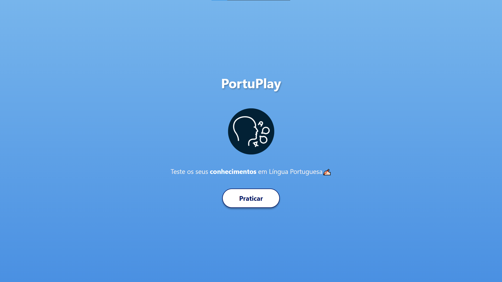
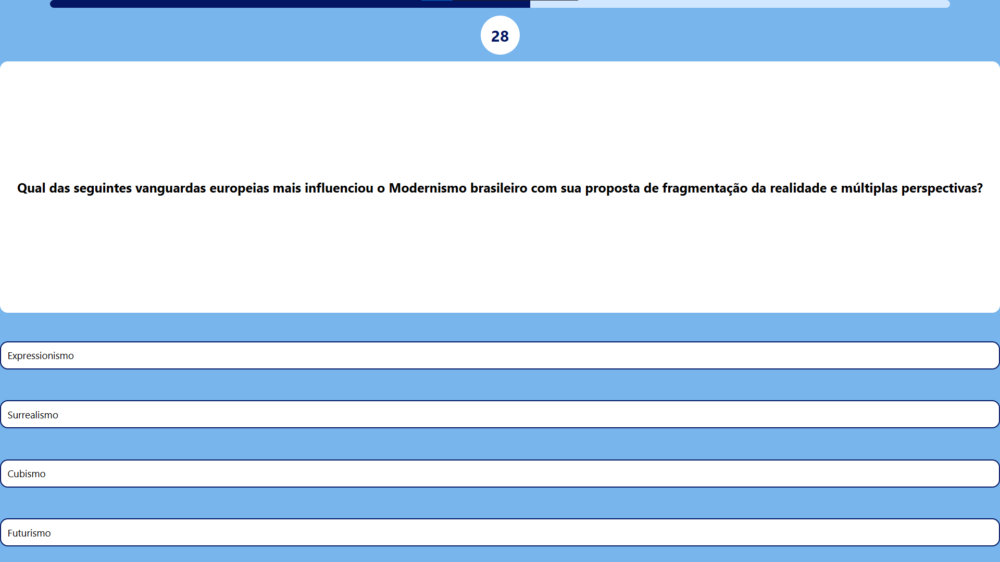
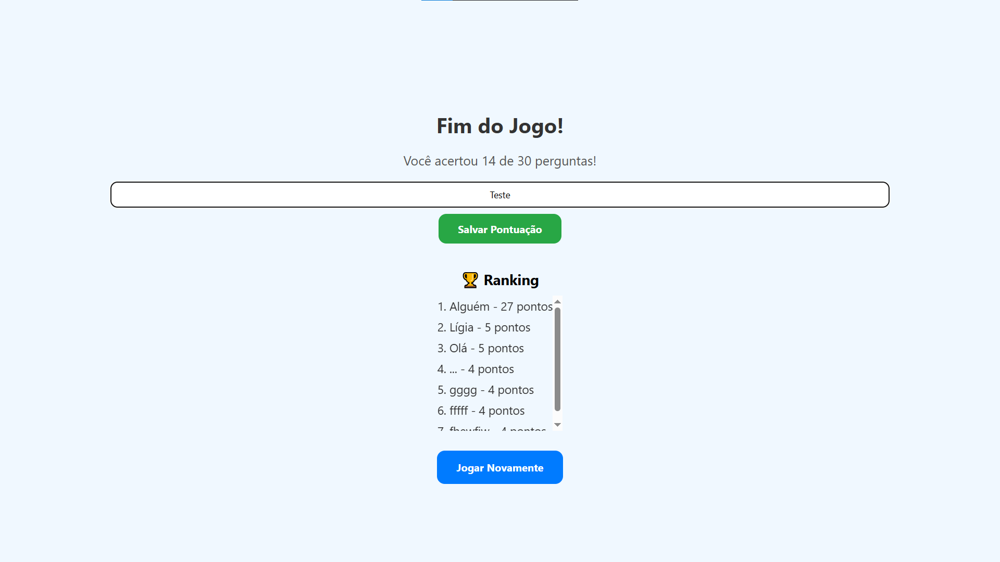

# 📚 PortuPlay – Quiz de Língua Portuguesa

Aplicativo desenvolvido em **React Native + Expo** para ajudar estudantes a praticarem conteúdos de **Língua Portuguesa** de forma divertida e gamificada.  
O app conta com tela inicial estilizada, perguntas embaralhadas, ranking persistente e feedback sonoro/tátil.

---

## ✨ Funcionalidades Principais

- 🎮 **Tela Inicial** com logo e botão **Praticar**.
- ❓ **Perguntas de múltipla escolha** embaralhadas a cada rodada.
- ⏳ **Cronômetro de 30 segundos por pergunta** (marca como errada se zerar).
- 📊 **Barra de Progresso** que mostra avanço no quiz (30 questões no total).
- 🔊 **Feedback sonoro** (acerto/erro) e tátil com Haptics.
- 🏆 **Ranking persistente** usando `AsyncStorage`:
  - Jogador insere nome no fim do jogo.
  - Pontuação é salva e ordenada automaticamente.
  - Exibe o **Top 10 jogadores**.
- 📱 **Design responsivo** com uso de `SafeAreaView`.

---

## 🎯 Funcionalidade Adicional: Barra de Progresso + Cronômetro

### Descrição
Essa feature adiciona:
1. **Barra de Progresso**  
   - Avança conforme o jogador responde perguntas.  
   - Progresso calculado como fração (`(índice atual + 1) / total`).  

2. **Cronômetro Iniciado com o Jogo**  
   - Timer de **30 segundos** para cada questão.  
   - Só começa quando o jogador pressiona **Praticar**.  
   - Se chegar a zero, a questão é considerada errada e o quiz avança automaticamente.  

### ⚡ Desafios e Aprendizados
- Precisei pesquisar sobre o **Hook `useEffect`** para reiniciar o cronômetro a cada nova questão.  
- Aprendi a usar o **`Animated` do React Native** para criar a barra de progresso sem depender de bibliotecas externas.  
- Ajustei o cálculo de progresso para trabalhar com **frações (0..1)** em vez de porcentagens.  
- Refatorei a lógica de controle de estado (`isQuizStarted`) para que o timer só inicie após clicar em **Praticar**.  

### 🎥 Demonstração
<video src="assets/video-quiz.mp4" controls width="400"></video>

#### Tela Inicial


#### Barra de Progresso + Timer


#### Ranking Final


---

## 🚀 Tecnologias Utilizadas

- **React Native + Expo**
- **TypeScript**
- **AsyncStorage** → salvar ranking e recordes
- **Expo AV** → sons de acerto/erro
- **Expo Haptics** → vibração tátil
- **Animated API** → barra de progresso
- **SafeAreaView** → layout seguro em iOS/Android

---

## 📌 Como Rodar o Projeto

```cmd
# 1. Clonar o repositório
git clone https://github.com/Ligia-Costa/quiz-app.git

# 2. Entrar na pasta
cd quiz-app

# 3. Instalar dependências
npm install

# 4. Rodar no Expo
npm start
```
---

## Instalação do projeto
Instale o projeto através do Qr Code ou link:
- https://expo.dev/accounts/liih-costa/projects/quiz-app/builds/a41fd658-30df-45eb-b54d-fc00abda11ae
- 

---

## 👩🏻‍💻 Projeto desenvolvido por

**Lígia da Costa Silva**  
Curso Técnico em Análise e Desenvolvimento de Sistemas - SENAI - 2025

[](www.linkedin.com/in/lígia-costa-16080118b) 
[](https://www.instagram.com/liiih.costa/)
[](https://github.com/Ligia-Costa)

## 📄 Licença

Este projeto está licenciado sob a licença [MIT](https://opensource.org/licenses/MIT).
